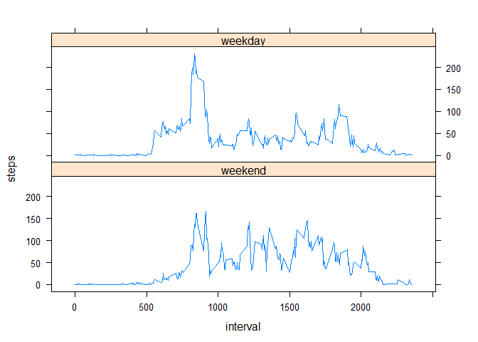

Introduction
============

It is now possible to collect a large amount of data about personal movement using activity monitoring devices such as a Fitbit, Nike Fuelband, or Jawbone Up. These type of devices are part of the "quantified self" movement -- a group of enthusiasts who take measurements about themselves regularly to improve their health, to find patterns in their behavior, or because they are tech geeks. But these data remain under-utilized both because the raw data are hard to obtain and there is a lack of statistical methods and software for processing and interpreting the data.

This assignment makes use of data from a personal activity monitoring device. This device collects data at 5 minute intervals through out the day. The data consists of two months of data from an anonymous individual collected during the months of October and November, 2012 and include the number of steps taken in 5 minute intervals each day.

``` r
library(knitr)
opts_chunk$set(echo = TRUE)
```

Load and explore the data
=========================

``` r
act <- read.csv("activity.csv")
names(act)
```

    ## [1] "steps"    "date"     "interval"

``` r
head(act); tail(act)
```

    ##   steps       date interval
    ## 1    NA 2012-10-01        0
    ## 2    NA 2012-10-01        5
    ## 3    NA 2012-10-01       10
    ## 4    NA 2012-10-01       15
    ## 5    NA 2012-10-01       20
    ## 6    NA 2012-10-01       25

    ##       steps       date interval
    ## 17563    NA 2012-11-30     2330
    ## 17564    NA 2012-11-30     2335
    ## 17565    NA 2012-11-30     2340
    ## 17566    NA 2012-11-30     2345
    ## 17567    NA 2012-11-30     2350
    ## 17568    NA 2012-11-30     2355

``` r
str(act)
```

    ## 'data.frame':    17568 obs. of  3 variables:
    ##  $ steps   : int  NA NA NA NA NA NA NA NA NA NA ...
    ##  $ date    : Factor w/ 61 levels "2012-10-01","2012-10-02",..: 1 1 1 1 1 1 1 1 1 1 ...
    ##  $ interval: int  0 5 10 15 20 25 30 35 40 45 ...

``` r
summary(act)
```

    ##      steps                date          interval     
    ##  Min.   :  0.00   2012-10-01:  288   Min.   :   0.0  
    ##  1st Qu.:  0.00   2012-10-02:  288   1st Qu.: 588.8  
    ##  Median :  0.00   2012-10-03:  288   Median :1177.5  
    ##  Mean   : 37.38   2012-10-04:  288   Mean   :1177.5  
    ##  3rd Qu.: 12.00   2012-10-05:  288   3rd Qu.:1766.2  
    ##  Max.   :806.00   2012-10-06:  288   Max.   :2355.0  
    ##  NA's   :2304     (Other)   :15840

Process the data. Set the act$date to "Date" class
==================================================

``` r
act$date <- as.Date(act$date)
class(act$date)
```

    ## [1] "Date"

1. What is mean total number of steps taken per day?
====================================================

-   Calculate the total number of steps taken per day
-   Make a histogram of the total number of steps taken each day
-   Calculate and report the mean and median of the total number of steps taken per day

``` r
steps_total <- tapply(act$steps, act$date, sum, na.rm=TRUE)
hist(steps_total, breaks = 40, main = "Histogram of number of steps per day", xlab = "Number of steps")
```


``` r
median(steps_total, na.rm=TRUE)
```

    ## [1] 10395

``` r
mean(steps_total, na.rm=TRUE)
```

    ## [1] 9354.23

2. What is the average daily act pattern?
=========================================

-   Make a time series plot (i.e. type = "l") of the 5-minute interval (x-axis) and the average number of steps taken, averaged across all days (y-axis)
-   Which 5-minute interval, on average across all the days in the dataset, contains the maximum number of steps?

``` r
steps_interval <- tapply(act$steps, factor(act$interval), mean, na.rm=TRUE)

plot(unique(act$interval),steps_interval, type = "l", 
     xlab="Identifier for 5-minute Interval", ylab="Average Number of Steps", 
     main="Number of Steps - Average Daily Activity Pattern")
```


``` r
act$interval[which.max(steps_interval)]
```

    ## [1] 835

3. Imputing missing values
==========================

-   Calculate and report the total number of missing values in the dataset (i.e. the total number of rows with NAs)
-   Devise a strategy for filling in all of the missing values in the dataset. The strategy does not need to be sophisticated. For example, you could use the mean/median for that day, or the mean for that 5-minute interval, etc.
-   Create a new dataset that is equal to the original dataset but with the missing data filled in.
-   Make a histogram of the total number of steps taken each day and Calculate and report the mean and median total number of steps taken per day. Do these values differ from the estimates from the first part of the assignment? What is the impact of imputing missing data on the estimates of the total daily number of steps?

The missing data are imputed by using a mean for the 5-minute interval

``` r
sum(is.na(act$steps))
```

    ## [1] 2304

``` r
library(dplyr)
```

    ## 
    ## Attaching package: 'dplyr'

    ## The following objects are masked from 'package:stats':
    ## 
    ##     filter, lag

    ## The following objects are masked from 'package:base':
    ## 
    ##     intersect, setdiff, setequal, union

``` r
act_noNA <- act
nas <- is.na(act$steps) # indices of NA in act$steps
mean_interval <- tapply(act$steps, act$interval, mean, na.rm=TRUE)
act_noNA$steps[nas] <- mean_interval[as.character(act$interval[nas])]
sum(is.na(act_noNA$steps)) # Check if act_noNA have NA's
```

    ## [1] 0

``` r
# Total number of steps per day
steps_total_noNA <- tapply(act_noNA$steps, act_noNA$date, sum)


hist(steps_total_noNA, breaks = 40, main = "Histogram of number of steps per day \nImputed values", xlab = "Number of steps")
```


``` r
median(steps_total_noNA)
```

    ## [1] 10766.19

``` r
mean(steps_total_noNA)
```

    ## [1] 10766.19

The median and mean for data frame with imputed valus is greated in compare to the results from data frame without imputed values. The reason is that by imputing values (in this particular case replacing NA with mean) we replace NA with positive values, and add them to the calculations. As a result days that previously have values of only zeros and NA's have average equal 0, when NA are not imputed, and avearage above 0 after NA imputing.

4. Are there differences in activity patterns between weekdays and weekends?
============================================================================

-   Create a new factor variable in the dataset with two levels - "weekday" and "weekend" indicating whether a given date is a weekday or weekend day.
-   Make a panel plot containing a time series plot (i.e. type = "l") of the 5-minute interval (x-axis) and the average number of steps taken, averaged across all weekday days or weekend days (y-axis).

``` r
weekdays <- c("Monday", "Tuesday", "Wednesday", "Thursday", "Friday")
weekend <- c("Sunday", "Saturday")

act_noNA_week <- mutate(act_noNA, 
                        daycat = factor(1*weekdays(as.Date(date)) %in% weekdays, 
                                            labels = c("weekend", "weekday")))

act_noNA_week$daycat <- as.factor(act_noNA_week$daycat) 
interval_full <- group_by(act_noNA_week, interval, daycat)
toplot <- summarize(interval_full, steps=mean(steps))


library(lattice)
par(mfcol=c(5,1))
xyplot(steps~interval | daycat, data = toplot, type = "l", layout= c(1,2))
```


